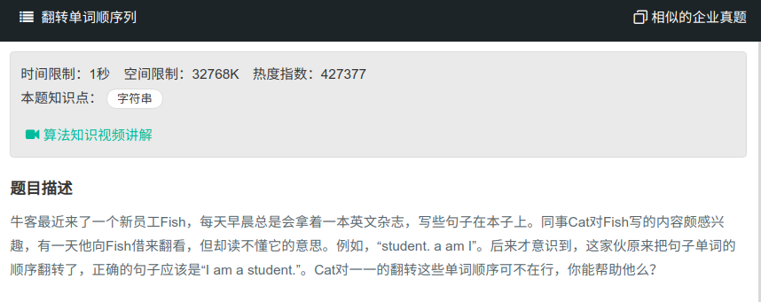

## 翻转单词顺序列



#### [翻转单词顺序列](https://www.nowcoder.com/practice/3194a4f4cf814f63919d0790578d51f3?tpId=13&tqId=11197&tPage=3&rp=1&ru=%2Fta%2Fcoding-interviews&qru=%2Fta%2Fcoding-interviews%2Fquestion-ranking)

#### 思路

先整体反转，再按空格逐单词反转。

```java
public class Solution{
    public String ReverseSentence(String str) {
		char[] ch = str.toCharArray();
        reverse(ch, 0, ch.length-1);
		int start = 0;
        int end = 0;
        
        while (start < ch.length){
            if (end == ch.length || ch[end] == ' '){
                reverse(ch, start, end - 1);
                end = end + 1;
                start = end;
            }else {
                end = end + 1;
            }
        }
        return String(ch);
    }
    public void reverse (char[] ch, int start, int end) {
        while (start<end){
            char c = ch[end];
            ch[end] = ch[start];
            ch[start] = c;
            start++;
            end--;
        }
    }
}
```

