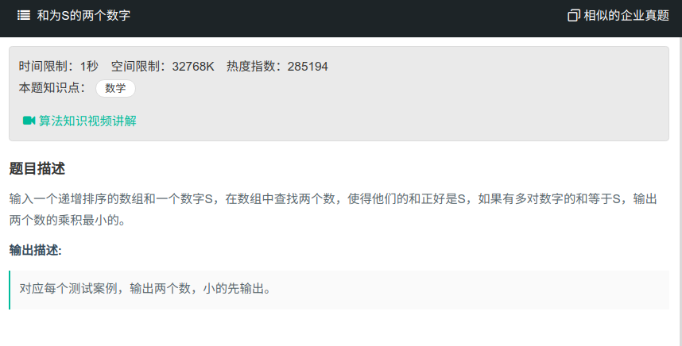

## 和为S的两个数字



#### [和为S的两个数字](https://www.nowcoder.com/practice/390da4f7a00f44bea7c2f3d19491311b?tpId=13&tqId=11195&tPage=3&rp=1&ru=%2Fta%2Fcoding-interviews&qru=%2Fta%2Fcoding-interviews%2Fquestion-ranking)

#### 思路

使用两个指针，一个指向数组头，一个指向数组尾，若和相等于sum，则返回，若大于，end--，若小于，start++。

```java
public class Solution{
    public ArrayList<Integer> FindNumbersWithSum(int [] array,int sum) {
		ArrayList<Integer> res = new ArrayList<>();
        int start = 0;
        int end = array.length - 1;
        while (start < end){
            if (array[start] + array[end] == sum){
                res.add(start);
                res.add(end);
                break;
            }
            if (array[start] + array[end] < sum){
                start++;
            }
            if (array[start] + array[end] > sum){
                end--;
            }
        }
        return res;
    }
}
```

