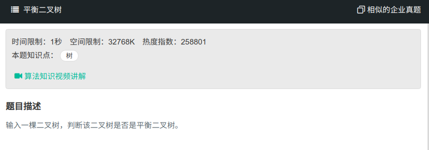

## 平衡二叉树



#### [平衡二叉树](https://www.nowcoder.com/practice/8b3b95850edb4115918ecebdf1b4d222?tpId=13&tqId=11192&tPage=2&rp=1&ru=%2Fta%2Fcoding-interviews&qru=%2Fta%2Fcoding-interviews%2Fquestion-ranking)

#### 思路

使用递归，后续遍历，判断两子树深度之差是否小于1。

```java
public class Solution{
    public boolean flag = true;
    public boolean IsBalanced_Solution(TreeNode root) {
		TreeLength(root);
        return flag;
    }
    private int TreeLength(TreeNode root){
        if (root == null){
            return 0;
        }
        int left = TreeLength(root.left):
        int right = TreeLength(root.right);
        if (left - right > 1 || right - left > 1){
            flag = false;
        }
        return Math.max(left, right) + 1;
    }
}
```

