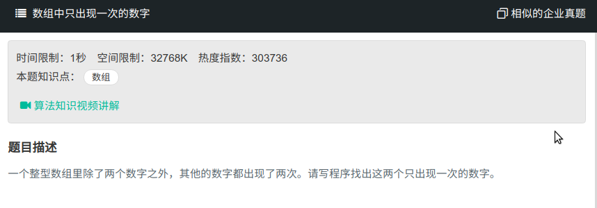

## 数组中只出现一次的数字



#### [数组中只出现一次的数字](https://www.nowcoder.com/practice/e02fdb54d7524710a7d664d082bb7811?tpId=13&tqId=11193&tPage=2&rp=1&ru=%2Fta%2Fcoding-interviews&qru=%2Fta%2Fcoding-interviews%2Fquestion-ran)

#### 思路

使用异或，最后得到两不相同数的异或值，找到为1的位置，以此来分组异或。

```java
public class Solution{
    public void FindNumsAppearOnce(int [] array,int num1[] , int num2[]) {
		int res = 0;
        for (int i = 0; i < array.length; i++){
            res = res ^ array[i];
        }
        
        int index = isOne(res);
        for (int i = 0; i < array.length; i++){
        	if (isIndex(index, array[i])){
                num1[0] = num1[0] ^ array[i];
            }else{
                num2[0]^=array[i];
            }
        }
        
    }
    private int isOne(int num){
		int index = 0;
        while(num != 0){
            if ((num & 1) == 1){
                return index;
            }
            num = num >> 1;
            index++;
        }
        return -1;
    }
    private boolean isIndex(int index, int num){
        num = num >> index;
        return (num & 1)==1;
    }
}
```

