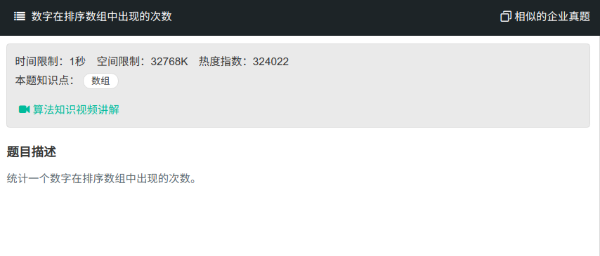

## 数字在排序数组中出现的次数



#### [数字在排序数组中出现的次数](https://www.nowcoder.com/practice/70610bf967994b22bb1c26f9ae901fa2?tpId=13&tqId=11190&tPage=2&rp=1&ru=%2Fta%2Fcoding-interviews&qru=%2Fta%2Fcoding-interviews%2Fquestion-ranking)

#### 思路

二分查找

查找k与k+1的最左位置，最后用k+1的位置减去k的位置。

```java
public class Solution{
    public int GetNumberOfK(int [] array , int k) {
		if (array == null || array.length == 0){
            return 0;
        }
        if (k < array[0]){
            return 0;
        }
        int first = binarySearch(array, k);
        int last = binarySearch(array, k+1);
        return (first==array.length || array[first]!=k)?0:last-first;
    }
    public int binarySearch(int[] nums, int k){
        int left = 0;
        int right = array.length;
        
        while(left < right){
            int mid = left + (right - left)/2;
            if (nums[mid] >= k){
                right = mid;
            }else{
                left = mid + 1;
            }
        }
        return left;
    }
}
```

