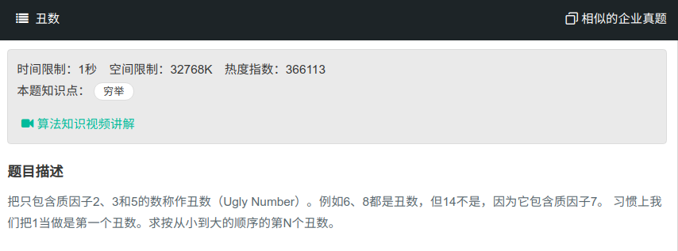

## 丑数



#### [丑数](https://www.nowcoder.com/practice/6aa9e04fc3794f68acf8778237ba065b?tpId=13&tqId=11186&tPage=2&rp=1&ru=%2Fta%2Fcoding-interviews&qru=%2Fta%2Fcoding-interviews%2Fquestion-ranking)

#### 思路

使用三个指针分别表示以2,3,5为基数的当前最小值。

```java
public class Solution{
    public int GetUglyNumber_Solution(int index) {
		if (index < 1){
            return 0;
        }
        int[] res = new int[index];
        res[0] = 1;
        int i2 = 0;
        int i3 = 0;
        int i5 = 0;
        for (int i = 1; i < index; i++){
            int tmp2 = res[i2] * 2;
            int tmp3 = res[i3] * 3;
            int tmp5 = res[i5] * 5;
            int temp = Math.Min(tmp2, Math.Min(tmp3, tmp5));
            res[i] = temp;
            if (res[i]==tmp2) i2++;
            if (res[i]==tmp3) i3++;
            if (res[i]==tmp5) i5++;        
        }
        return res[index-1];
    }
}
```

