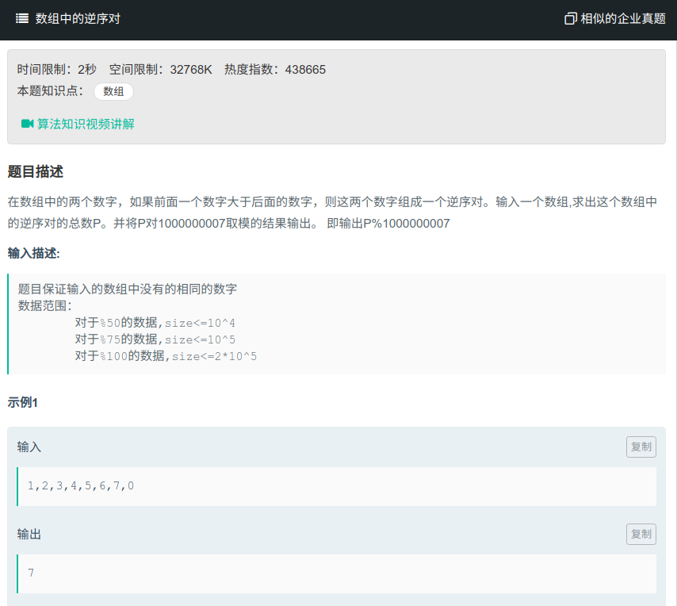

## 数组中的逆序对



#### [数组中的逆序对](https://www.nowcoder.com/practice/96bd6684e04a44eb80e6a68efc0ec6c5?tpId=13&tqId=11188&tPage=2&rp=1&ru=%2Fta%2Fcoding-interviews&qru=%2Fta%2Fcoding-interviews%2Fquestion-ranking)

#### 思路

使用归并排序，在排序途中计算逆序对的个数。

```java
public class Solution{
    int res;
    int [] tmp;
	public int InversePairs(int[] array) {
		res = 0;
        tmp = new int[array.length];
        if (array==null || array.length == 0){
            return 0;
        }
        sort(array, 0, array.length-1);
        return res;
    }
    public void sort(int[] array, int start, int end){
        if (start == end){
            return;
        }
        int mid = (start+end)/2;
        sort(array, start, mid);
        sort(array, mid+1, end);
        merge(array, start, mid, end);
    }
    public merge(int[] array, int start, int mid, int end){
        int i = mid;
        int j = end;
        int index = end;
        for (k = start; k<=right; k++){
            tmp[k] = array[k];
        }
        while(i >= start, j >= mid + 1){
            if (tmp[i] > tmp[j]){
                array[index] = tmp[i];
                index--;
                i--;
                res = res + j - mid;//计算逆序对的个数
				if (res > 1000000007) {
					res %= 1000000007;
				}
            } else {
                array[index--] = temp[j--];
            }
            while (i >= start){
                array[index--] = tmp[i--];
            }
            while (j >= mid+1){
                array[index--] = tmp[j--];
            }
        }
    }
}
```

