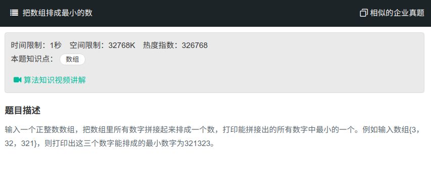

## 把数组排成最小的数



#### [把数组排成最小的数](https://www.nowcoder.com/practice/8fecd3f8ba334add803bf2a06af1b993?tpId=13&tqId=11185&tPage=2&rp=1&ru=%2Fta%2Fcoding-interviews&qru=%2Fta%2Fcoding-interviews%2Fquestion-ranking)

#### 思路

comparator.

```java
public class Solution{
    public String PrintMinNumber(int [] numbers) {
		StringBuffer str = new StringBuffer();
        String[] tmp = new String[numbers.length];
        for (int i = 0; i < numbers.length; i++){
            tmp[i] = String.valueOf(numbers[i]);
        }
        Arrays.sort(tmp, new Comparator<String>(){
            public int compare(String s1, String s2){
                String c1 = s1 + s2;
                String c2 = s2 + s1;
                return c1.compareTo(c2);
            }
        });
        for(int i = 0; i < numbers.len; i++){
            str.append(tmp[i]);
        }
        return str.toString();
    }
}
```

