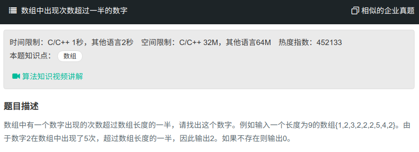

## 数组中出现次数超过一般的数字



#### [数组中出现次数超过一般的数字](https://www.nowcoder.com/practice/e8a1b01a2df14cb2b228b30ee6a92163?tpId=13&tqId=11181&tPage=2&rp=1&ru=%2Fta%2Fcoding-interviews&qru=%2Fta%2Fcoding-interviews%2Fquestion-ranking)

#### 思路

使用一个数保存出现最多次的数的个数，当前数若等于此数，则次数加一，否则次数减一。

```java
public class Solution{
    public int MoreThanHalfNum_Solution(int [] array) {
		if (array == null || array.length == 0){
            return 0;
        }
        
        int times = 1;
        int num = array[0];
        for (int i = 1; i < array.length; i++){
            if (times == 0){
                times++;
                num = array[i];
            }else{
                if (num == array[i]){
                	times++;
                }else{
                    times--;
                }
            }
        }
        int nums = 0;
        for (int i = 0; i < array.length; i++){
            if (array[i] == num){
                nums++;
            }
        }
        if (nums>array.length/2){
            return num;
        }
        return 0;
    }
}
```

