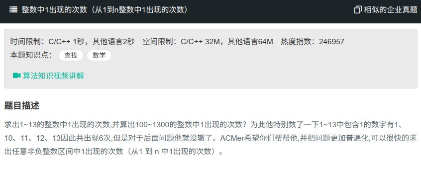

## 整数中1出现的次数



#### [整数中1出现的次数](https://www.nowcoder.com/practice/bd7f978302044eee894445e244c7eee6?tpId=13&tqId=11184&tPage=2&rp=1&ru=%2Fta%2Fcoding-interviews&qru=%2Fta%2Fcoding-interviews%2Fquestion-ranking)

#### 思路

循环判断

```java
public class Solution{
    public int NumberOf1Between1AndN_Solution(int n) {
		int sum = 0;
        for (int i = 1; i <= n; i++){
            char[] tmp = String.valueOf(i).toCharArray();
            for (char c : tmp){
                if (c == 'i'){
                    sum++;
                }
            }
        }
        return sum;
    }
}
```

