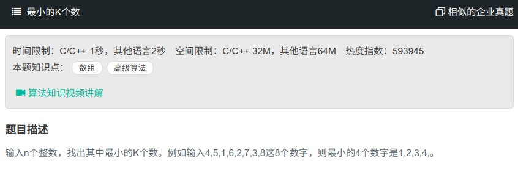

## 最小的K个数



#### [最小的K个数](https://www.nowcoder.com/practice/6a296eb82cf844ca8539b57c23e6e9bf?tpId=13&tqId=11182&tPage=2&rp=1&ru=%2Fta%2Fcoding-interviews&qru=%2Fta%2Fcoding-interviews%2Fquestion-ranking)

#### 思路

使用小根堆保存最小的k个数。

```java
public class Solution{
    public ArrayList<Integer> GetLeastNumbers_Solution(int [] input, int k) {
        ArrayList<Interger> res = new ArrayList<>();
		if (input == null || input.length == 0 || k > array.length){
            return res;
        }
        PriorityQueue<Integer> tmp = new PriorityQueue<Integer>(k,new Comparator<Integer>(){
            public int compare (Integer e1, Integer e2){
                return e2 - e1;
            }
        });
        for (int i = 0; i < input.length; i++){
            if (tmp.size != k){
                tmp.offer(input[i]);
            }else{
                if (tmp.peek() > input[i]){
                    tmp.poll();
                    tmp.offer(input(i));
                }
            }
        }
        for (Integer i : tmp){
            res.add(i);
        }
        return res;
    }
}
```

