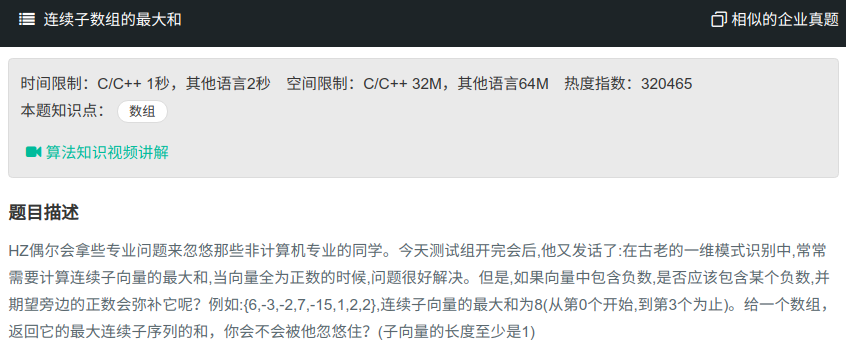

## 连续子数组的最大和



#### [连续子数组的最大和](https://www.nowcoder.com/practice/459bd355da1549fa8a49e350bf3df484?tpId=13&tqId=11183&tPage=2&rp=1&ru=%2Fta%2Fcoding-interviews&qru=%2Fta%2Fcoding-interviews%2Fquestion-ranking)

#### 思路

动态规划，使用一个值保存从开头到目前数字的最大值。

```java
public class Solution{
    public int FindGreatestSumOfSubArray(int[] array) {
		int sum = array[0];
    	int tmp = array[0];
        
        for (int i = 1; i < array.length; i++){
        	tmp = tmp > 0 ? tmp + array[i] : array[i];
            if (tmp > sum){
                sum = tmp;
            }
        }
        return sum;
    }
}
```

