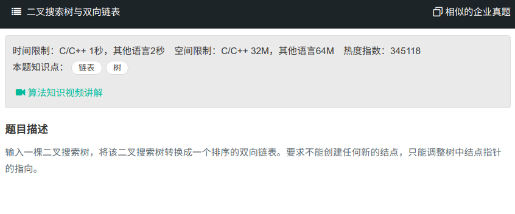

## 二叉搜索树与双向链表



#### [二叉搜索树与双向链表](https://www.nowcoder.com/practice/947f6eb80d944a84850b0538bf0ec3a5?tpId=13&tqId=11179&tPage=2&rp=1&ru=%2Fta%2Fcoding-interviews&qru=%2Fta%2Fcoding-interviews%2Fquestion-ranking)

#### 思路

中序遍历，左子树的最右节点连接树根，右节点最左节点连接树根，递归返回的是最左节点。

```java
/**
public class TreeNode {
    int val = 0;
    TreeNode left = null;
    TreeNode right = null;

    public TreeNode(int val) {
        this.val = val;

    }

}
*/

public class Solution{
    public TreeNode Convert(TreeNode root) {
		if (root == null){
            return null;
        }
        if (root.left == null && root.right == null){
            return root;
        }
        TreeNode left = Convert(root.left);
        TreeNode p = left;
        while (p != null && p.right != null){
            p = p.right;
        }
        if (left != null){
            p.right = root;
            root.left = p;
        }
        
        TreeNode right = Convert(root.right);
        if (right != null){
            right.left = root;
            root.right = right;
        }
        return left!=null?left:right;
    }
}
```

