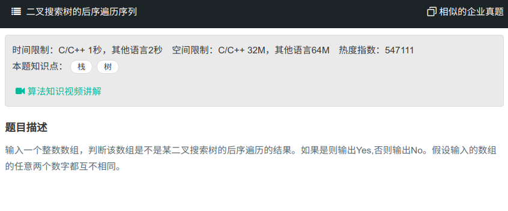

## 二叉搜索树的后序遍历序列



#### [二叉搜索树的后序遍历序列](https://www.nowcoder.com/practice/a861533d45854474ac791d90e447bafd?tpId=13&tqId=11176&tPage=2&rp=1&ru=%2Fta%2Fcoding-interviews&qru=%2Fta%2Fcoding-interviews%2Fquestion-ranking)

#### 思路

递归进行判断，后序遍历中最后一个节点为当前子树根节点，小于此节点值的左半部分序列为左子树，右半部分大于此值为右子树。

```java
public class Solution {
    public boolean VerifySquenceOfBST(int [] sequence) {
        if (sequence.length == 0){
            return false;
        }
        if (sequence.length == 1){
            return true;
        }
        return judge(sequence, 0, sequence.length-1);
    }
    public boolean judge(int [] sequence, int start, int end){
        if(start >= end)
            return true;
        int i = start;
        while (i<end && sequence[i] < sequence[end]){
            i++;
        }
        for(int j=i; j<end; j++){
            if(sequence[j]<sequence[end])
                return false;
        }
        return (judge(sequence, start, i-1)) && (judge(sequence, i, end-1));
    }
}
```

