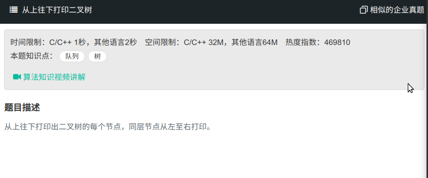

## 从上往下打印二叉树



#### [从上往下打印二叉树](https://www.nowcoder.com/practice/7fe2212963db4790b57431d9ed259701?tpId=13&tqId=11175&tPage=2&rp=1&ru=%2Fta%2Fcoding-interviews&qru=%2Fta%2Fcoding-interviews%2Fquestion-ranking)

#### 思路

递归进行判断，后序遍历中最后一个节点为当前子树根节点，小于此节点值的左半部分序列为左子树，右半部分大于此值为右子树。

```java
import java.util.ArrayList;
import java.util.Queue;
import java.util.LinkedList;
/**
public class TreeNode {
    int val = 0;
    TreeNode left = null;
    TreeNode right = null;

    public TreeNode(int val) {
        this.val = val;

    }

}
*/
public class Solution {
    public ArrayList<Integer> PrintFromTopToBottom(TreeNode root) {
		ArrayList<Integer> res = new ArrayList<>();
        if (root == null){
            return res;
        }
        Queue<Integer> list = new LinkedList<>();
        list.offer(root);
        while (list.size() != 0){
            TreeNode node = list.remove();
            res.add(node.val);
            if (node.left != null){
                list.offer(node.left);
            }
            if (node.right != null){
                list.offer(node.right);
            }
        }
        return res;
    }
}
```

