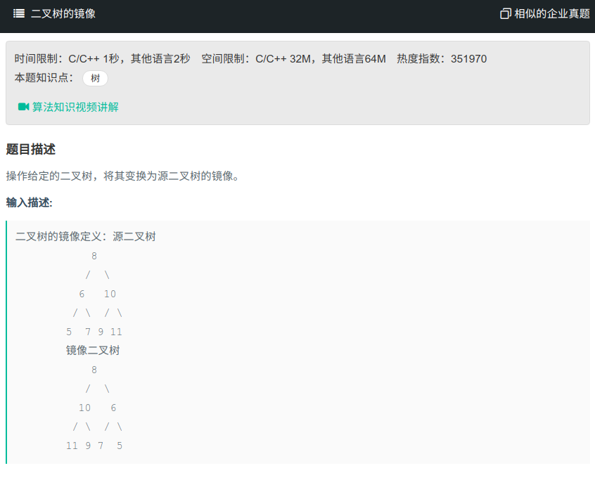

## 二叉树的镜像



#### [二叉树的镜像](https://www.nowcoder.com/practice/564f4c26aa584921bc75623e48ca3011?tpId=13&tqId=11171&tPage=1&rp=1&ru=%2Fta%2Fcoding-interviews&qru=%2Fta%2Fcoding-interviews%2Fquestion-ranking)

#### 思路

利用先序遍历，将树的左子树和右子数交换。

```java
/**
public class TreeNode {
    int val = 0;
    TreeNode left = null;
    TreeNode right = null;

    public TreeNode(int val) {
        this.val = val;

    }

}
*/
//先序遍历
public class Solution {
    public void Mirror(TreeNode root) {
		if (root == null){
            return;
        }
        TreeNode tmp = root.right;
        root.right = root.left;
        root.left = tmp;
        Mirror(root.left);
        Mirror(root.right);
    }
}
```

