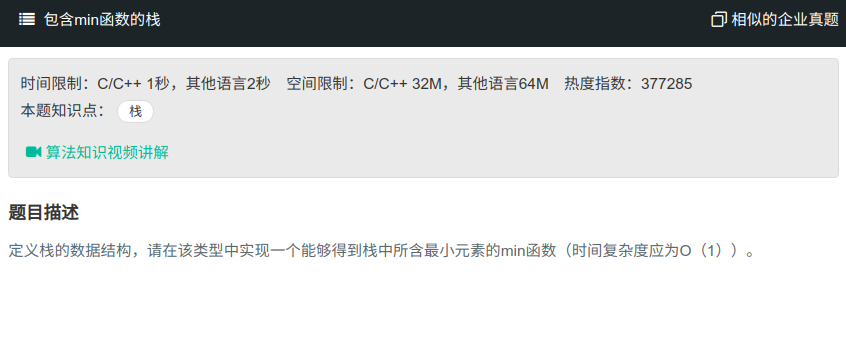

## 包含min函数的栈



#### [包含min函数的栈](https://www.nowcoder.com/practice/4c776177d2c04c2494f2555c9fcc1e49?tpId=13&tqId=11173&tPage=1&rp=1&ru=%2Fta%2Fcoding-interviews&qru=%2Fta%2Fcoding-interviews%2Fquestion-ranking)

#### 思路

使用两个栈，一个保存数，一个保存当前最小值。

```java
import java.util.Stack;

public class Solution {

    Stack<Integer> stack = new Stack<>();
    Stack<Integer> min = new Stack<>();
    public void push(int node) {
        stack.push(node);
        if (min.isEmpty() || node < min.peek()){
            min.push(node);
        }else{
            min.push(min.peek());
        }
    }
    
    public void pop() {
        if(!stack.empty()) {
            stack.pop();
            min.pop();
        }
    }
    
    public int top() {
        return stack.peek();
    }
    
    public int min() {
        return min.peek();
    }
}
```

