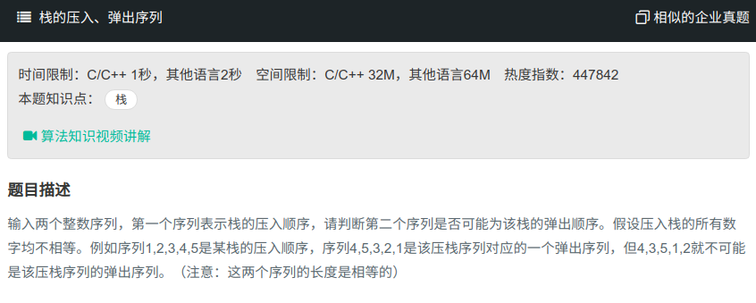

## 栈的压入、弹出序列



#### [栈的压入、弹出序列](https://www.nowcoder.com/practice/d77d11405cc7470d82554cb392585106?tpId=13&tqId=11174&tPage=2&rp=1&ru=%2Fta%2Fcoding-interviews&qru=%2Fta%2Fcoding-interviews%2Fquestion-ranking)

#### 思路

使用栈，循环加入数组A中的数字，直到与数组二中的第一个数字相同，然后栈弹出相同的数，再进行下一个数的判断。

```java
import java.util.ArrayList;
import java.util.Stack;

public class Solution {
    public boolean IsPopOrder(int [] pushA,int [] popA) {
        int lengthA = pushA.length;
        Stack<Integer> stack = new Stack<>();
        int index = 0;
        for (int i = 0; i<lengthA; i++){
            stack.push(pushA[i]);
            while (!stack.empty() && stack.peek()== popA[index]){
                index++;
                stack.pop();
            }
        }
        return stack.empty();
    }
}
```

