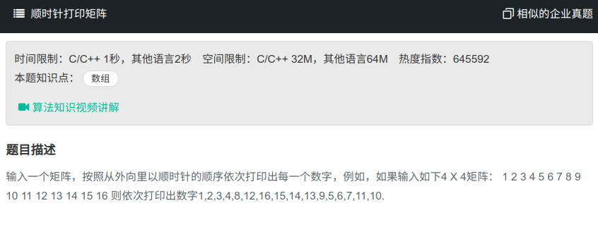

## 顺时针打印矩阵



#### [顺时针打印矩阵](https://www.nowcoder.com/practice/9b4c81a02cd34f76be2659fa0d54342a?tpId=13&tqId=11172&tPage=1&rp=1&ru=%2Fta%2Fcoding-interviews&qru=%2Fta%2Fcoding-interviews%2Fquestion-ranking)

#### 思路

通过右上角与左下角进行判断。

```java
import java.util.ArrayList;
public class Solution {
    public ArrayList<Integer> printMatrix(int [][] matrix) {
        int row = matrix.length;
        int col = matrix[0].length;
        ArrayList<Integer> res = new ArrayList<>();
        int left = 0, right = col - 1, top = 0, bottom = row - 1;
        while (left<=right && top<=bottom){
            for (int i = left; i <= right; i++){
                res.add(matrix[top][i]);
            }
            for (int i = top+1; i <= bottom; i++){
                res.add(matrix[i][right]);
            }
            if (top<bottom){//当为一行时进行判断
                for (int i = right-1; i >= left; i--){
                    res.add(matrix[bottom][i]);
                }
            }
            if (right>left){//当为一列是进行判断
                for (int i = bottom-1; i > top; i--){
                    res.add(matrix[i][left]);
                }
            }
            left++; right--; top++; bottom--;
        }
        return res;
    }
}
```

