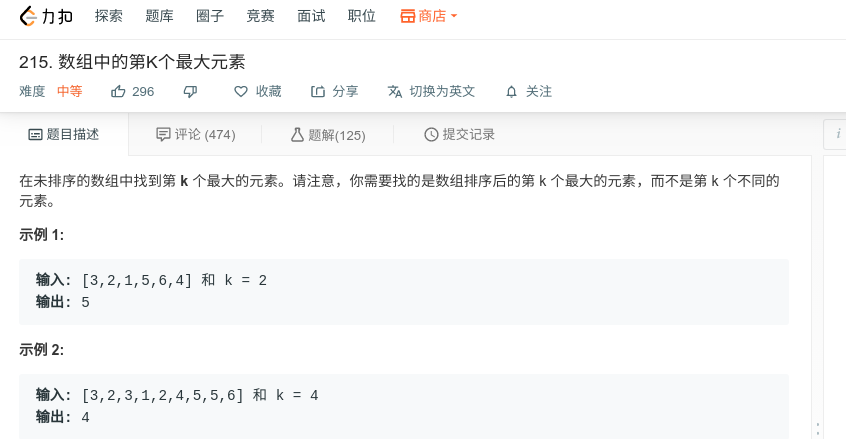

## 数组中的第K个最大元素



#### [数组中的第K个最大元素](https://leetcode-cn.com/problems/kth-largest-element-in-an-array/)

#### 思路

使用小根堆，保存最大的k个数。

```java
class Solution {
    public int findKthLargest(int[] nums, int k) {
        if (nums.length == 0 || nums == null){
            return 0;
        }
        PriorityQueue<Integer> res = new PriorityQueue<>(k);
        
        for (int i = 0; i < nums.length; i++){
            if (res.size() != k){
                res.add(nums[i]);
            }else{
                if (res.peek() < nums[i]){
                    res.poll();
                    res.add(nums[i]);
                }
            }
        } 
        System.out.println(res);
        int result = 0;

        result = res.poll();
        return result;
    }
}
```

