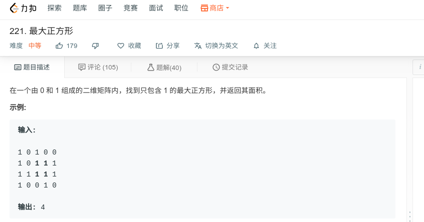

## 最大正方形



#### [最大正方形](https://leetcode-cn.com/problems/maximal-square/)

#### 思路

使用动态规划，需要注意边界条件。

` dp[i][j] = 1 + min(dp[i-1][j-1], dp[i-1][j], dp[i][j-1])`

```java
class Solution {
    public int maximalSquare(char[][] matrix) {
        /**
        dp[i][j]表示以第i行第j列为右下角所能构成的最大正方形边长, 则递推式为: 
        dp[i][j] = 1 + min(dp[i-1][j-1], dp[i-1][j], dp[i][j-1]);
        **/
        int m = matrix.length;
        if(m < 1) return 0;
        int n = matrix[0].length;
        int max = 0;
        int[][] dp = new int[m][n];
        for (int i = 0; i < n; i++){
            if(matrix[0][i] == '1'){
                dp[0][i] = 1;
                max = 1;
            }
        }
        for (int i = 0; i < m; i++){
            if(matrix[i][0] == '1'){
                dp[i][0] = 1;
                max = 1;
            }
        }        
        
        for(int i = 1; i < m; i++) {
            for(int j = 1; j < n; j++) {
                if(matrix[i][j] == '1') {
                    dp[i][j] = 1 + Math.min(dp[i-1][j-1], Math.min(dp[i-1][j], dp[i][j-1]));
                    max = Math.max(max, dp[i][j]); 
                }
            }
        }
        return max*max;
    }
}
```

