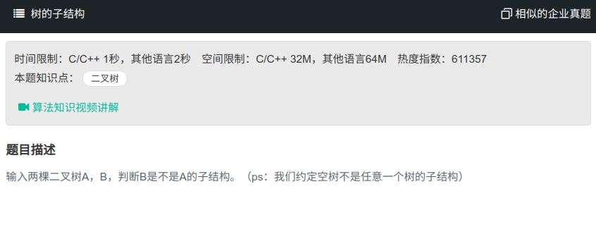

## 树的子结构



#### [树的子结构](https://www.nowcoder.com/practice/6e196c44c7004d15b1610b9afca8bd88?tpId=13&tqId=11170&tPage=1&rp=1&ru=%2Fta%2Fcoding-interviews&qru=%2Fta%2Fcoding-interviews%2Fquestion-ranking)

#### 思路

递归进行判断，若某一节点与子结构树的根节点相同，则进入辅助函数进行递归判断。

```java
/**
public class TreeNode {
    int val = 0;
    TreeNode left = null;
    TreeNode right = null;
    public TreeNode(int val) {
        this.val = val;
    }
}
*/
public class Solution {
    public boolean HasSubtree(TreeNode root1,TreeNode root2) {
		if (root1 == null || root2 == null){
            return false;
        }
        boolean flag = false;
        if (root1.val == root2.val){
            flag = isSubTree(root1, root2);
        }
        if (flag){
            return flag;
        }
        if(!=flag){
            flag = HasSubtree(root1.left, root2.left);
            if(flag){
                return true;
            }else{
                flag = HasSubtree(root1.right, root2.right);
                if(flag){
                    return true;
                }
            }
        }
        return false;
        
    }
    
    public boolean isSubTree(TreeNode root1, TreeNode root2){
        if (root2 == null){
            return true;
        }
        if (root1 == null){
            return false;
        }
        if (root1.val != root2.val){
            return false;
        }
        if (root1.val = root2.val){
            return isSubTree(root1.left, root2.left) && isSubTree(root1.right, root2.right)
        }
    }
}
```

