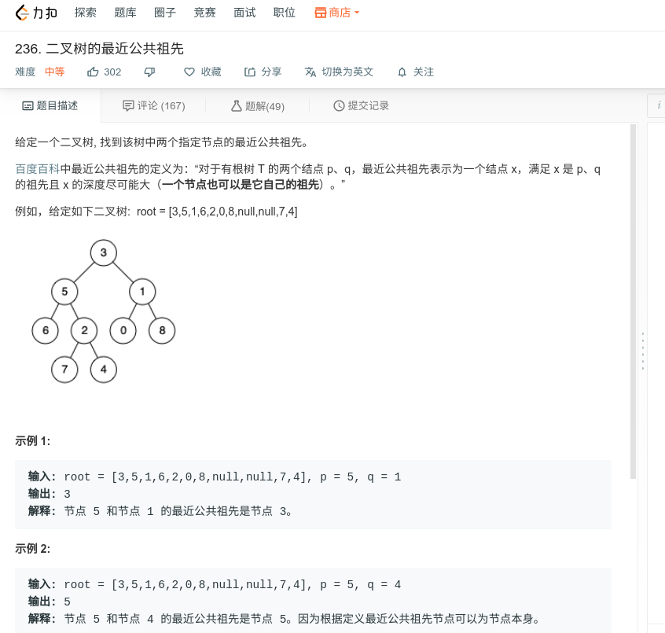

## 二叉树的最近公共祖先



#### [二叉树的最近公共祖先](https://leetcode-cn.com/problems/lowest-common-ancestor-of-a-binary-tree/)

#### 思路

递归，使用后序遍历，若左右都不为空的时候，返回当前节点，否则返回一个节点。

```java
/**
 * Definition for a binary tree node.
 * public class TreeNode {
 *     int val;
 *     TreeNode left;
 *     TreeNode right;
 *     TreeNode(int x) { val = x; }
 * }
 */
class Solution {
    public TreeNode lowestCommonAncestor(TreeNode root, TreeNode p, TreeNode q) {
		if (root == null){
            return null;
        }
        if (root == p || root == q){
            return root;
        }
        TreeNode left = lowestCommonAncestor(root.left, p, q);
        TreeNode right = lowestCommonAncestor(root.right, p, q);
        
        if(left != null && right!=null){
            return root;
        }else if(left!=null){
            return left;
        }else if(right!=null){
            return right;
        }
        return null;
    }
}
```

