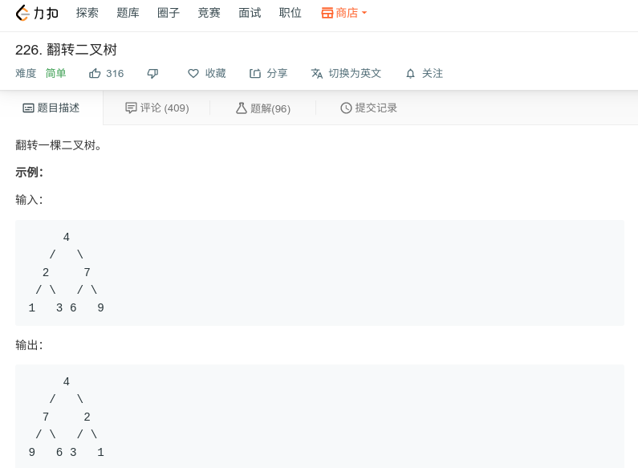

## 翻转二叉树



#### [226. 翻转二叉树](https://leetcode-cn.com/problems/invert-binary-tree/)思路

先序遍历

```java
/**
 * Definition for a binary tree node.
 * public class TreeNode {
 *     int val;
 *     TreeNode left;
 *     TreeNode right;
 *     TreeNode(int x) { val = x; }
 * }
 */
class Solution {
    public TreeNode invertTree(TreeNode root) {
        if (root==null){
            return null;
        }
        invert(root);
        return root;
        
    }
    public void invert(TreeNode root){
        if (root == null){
            return;
        }
        TreeNode tmp = root.right;
        root.right = root.left;
        root.left = tmp;
        invert(root.left);
        invert(root.right);
    }
}
```

