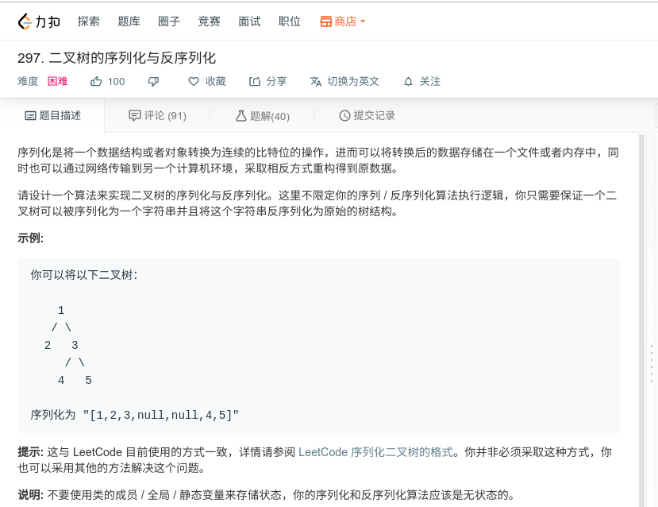

## 二叉树的序列化与反序列化



#### [297. 二叉树的序列化与反序列化](https://leetcode-cn.com/problems/serialize-and-deserialize-binary-tree/)

#### 思路

递归

```java
class Solution {
    public String serialize(TreeNode root) {
		StringBuilder res = new StringBuilder();
        return res.toString();
    }
    public String ser_help(TreeNode root, StringBuilder str){
        if (root == null){
            str.append("null,")
            return str;
        }
        str.append(root.val);
        str.append(",");
        str = ser_help(root.left, str);
        str = ser_help(root.right, str);
        return str;
    }
    public TreeNode deserialize(String data) {
        String[] str = data.split(",");
        List<String> list_word = new LinkedList<String>(Arrays.asList(str_word));
		return de_help(list_word);
    }
    public TreeNode de_help(List<String> li){
        if(li.get(0) == "null"){
            li.remove(0);
            return null;
        }
        TreeNode res = nes TreeNode(Integer.valueOf(li.get(0)));
        li.remove(0);
        res.left = de_help(li);
        res.right = de_help(li);
        return res;
    }
    
}
```

