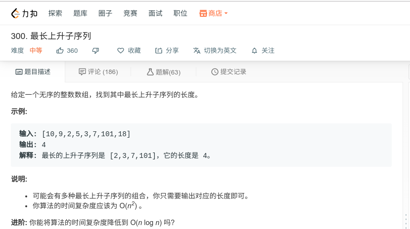

## 最长上升子序列



#### [300. 最长上升子序列](https://leetcode-cn.com/problems/longest-increasing-subsequence/)

#### 思路

动态规划

使用数组保存当前位置结尾是最大上升序列。

```java
class Solution {
    public int lengthOfLIS(int[] nums) {
		if(nums == null || nums.length == 0){
            return 0;
        }
        int[] maxList = new int[nums.length];
        int maxval = 0;
        maxList[0] = 1;
        for (int i = 1; i < nums.length; i++){
            int maxnum = 0;
            for (int j = 0; j < i; j++){
                if (nums[i] > nums[j]){
                    maxnum = Math.max(maxnum, maxList[i]);
                }
            }
            maxList[i] = maxnum + 1;
            maxval = Math,max(maxval, maxList[i]);
        }
        return maxval;
    }
}
```

